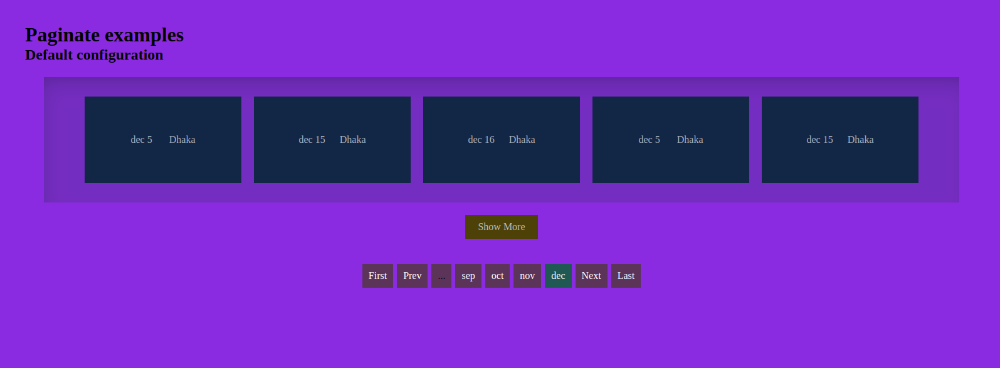

# pro-paginate

A open source pagination plugin using pure Javascript.



# Installation

To start using it straight away, place this in the head of your HTML code:

```html
<link
  rel="stylesheet"
  href="https://cdn.jsdelivr.net/npm/pro-paginate@1.0.1/src/style/style.css"
/>
<script src="https://cdn.jsdelivr.net/npm/pro-paginate@1.0.1/build/paginate.es5.js"></script>
```


Using a JavaScript package manager

If you use the npm package manager, you can fetch a local copy of pro-paginate by running:

```javascript
npm install pro-paginate
```

You will find a copy of the pro-paginate release files in node_modules/pro-paginate/src.

# Usage Guide

## `ProPaginate` Class

ProPaginate class is to make the most modern pagination. This allows to make pagination for monthly data.

### `ProPaginate` Class Usage Example

Here is the default creation of `ProPaginate`:

```html
<div id="paginate"></div>
```

```javascript
document.onreadystatechange = function () {
  if (document.readyState === 'complete') {
    const example_1 = new ProPaginate()
  }
}
```

You can do the customization and change the default settings providing the option object as parameter of `ProPaginate` class

```html
<div id="paginate-2"></div>
```

```javascript
const dummyData = [
  {
    month: 'jan',
    data: [
      {
        _date: 'Jan 20',
        location: 'Chattagram'
      }
    ]
  },
  {
    month: 'feb',
    data: [
      {
        _date: 'feb 20',
        location: 'Chattagram'
      }
    ]
  },
  {
    month: 'march',
    data: [
      {
        _date: 'march 12',
        location: 'Dhaka'
      }
    ]
  },
  {
    month: 'apr',
    data: [
      {
        _date: 'apr 12',
        location: 'Dhaka'
      },
      {
        _date: 'apr 32',
        location: 'Dhaka'
      }
    ]
  },
  {
    month: 'may',
    data: [
      {
        _date: 'may 5',
        location: 'Dhaka'
      },
      {
        _date: 'may 25',
        location: 'Dhaka'
      }
    ]
  },
  {
    month: 'jun',
    data: [
      {
        _date: 'jun 4',
        location: 'Dhaka'
      },
      {
        _date: 'jun 24',
        location: 'Dhaka'
      }
    ]
  },
  {
    month: 'jul',
    data: [
      {
        _date: 'jul 5',
        location: 'Dhaka'
      },
      {
        _date: 'jul 3',
        location: 'Dhaka'
      },
      {
        _date: 'jul 25',
        location: 'Dhaka'
      }
    ]
  },
  {
    month: 'aug',
    data: [
      {
        _date: 'aug 4',
        location: 'Dhaka'
      },
      {
        _date: 'aug 3',
        location: 'Dhaka'
      },
      {
        _date: 'aug 11',
        location: 'Dhaka'
      },
      {
        _date: 'aug 13',
        location: 'Dhaka'
      }
    ]
  },
  {
    month: 'sep',
    data: [
      {
        _date: 'sep 3',
        location: 'Dhaka'
      },
      {
        _date: 'sep 2',
        location: 'Dhaka'
      },
      {
        _date: 'sep 6',
        location: 'Dhaka'
      },
      {
        _date: 'sep 6',
        location: 'Dhaka'
      },
      {
        _date: 'sep 5',
        location: 'Dhaka'
      }
    ]
  },
  {
    month: 'oct',
    data: [
      {
        _date: 'oct 3',
        location: 'Dhaka'
      },
      {
        _date: 'oct 23',
        location: 'Dhaka'
      },
      {
        _date: 'oct 13',
        location: 'Dhaka'
      },
      {
        _date: 'oct 23',
        location: 'Dhaka'
      },
      {
        _date: 'oct 3',
        location: 'Dhaka'
      },
      {
        _date: 'oct 13',
        location: 'Dhaka'
      }
    ]
  },
  {
    month: 'nov',
    data: [
      {
        _date: 'nov 2',
        location: 'Dhaka'
      },
      {
        _date: 'nov 2',
        location: 'Dhaka'
      },
      {
        _date: 'nov 22',
        location: 'Dhaka'
      },
      {
        _date: 'nov 2',
        location: 'Dhaka'
      },
      {
        _date: 'nov 22',
        location: 'Dhaka'
      },
      {
        _date: 'nov 22',
        location: 'Dhaka'
      },
      {
        _date: 'nov 2',
        location: 'Dhaka'
      },
      {
        _date: 'nov 22',
        location: 'Dhaka'
      },
      {
        _date: 'nov 2',
        location: 'Dhaka'
      }
    ]
  },
  {
    month: 'dec',
    data: [
      {
        _date: 'dec 5',
        location: 'Dhaka'
      },
      {
        _date: 'dec 15',
        location: 'Dhaka'
      },
      {
        _date: 'dec 16',
        location: 'Dhaka'
      },
      {
        _date: 'dec 5',
        location: 'Dhaka'
      },
      {
        _date: 'dec 15',
        location: 'Dhaka'
      },
      {
        _date: 'dec 16',
        location: 'Dhaka'
      },
      {
        _date: 'dec 5',
        location: 'Dhaka'
      },
      {
        _date: 'dec 15',
        location: 'Dhaka'
      },
      {
        _date: 'dec 5',
        location: 'Dhaka'
      },
      {
        _date: 'dec 16',
        location: 'Dhaka'
      },
      {
        _date: 'dec 15',
        location: 'Dhaka'
      },
      {
        _date: 'dec 16',
        location: 'Dhaka'
      },
      {
        _date: 'dec 16',
        location: 'Dhaka'
      },
      {
        _date: 'dec 15',
        location: 'Dhaka'
      },
      {
        _date: 'dec 5',
        location: 'Dhaka'
      },
      {
        _date: 'dec 15',
        location: 'Dhaka'
      },
      {
        _date: 'dec 5',
        location: 'Dhaka'
      }
    ]
  }
]

let currentMonth = new Date().getMonth()
document.onreadystatechange = function () {
  if (document.readyState === 'complete') {
    const example_1 = new ProPaginate({
      data: dummyData,
      startpageNum: currentMonth,
      pageLinkAreaLabel: [
        'jan',
        'feb',
        'mar',
        'apr',
        'may',
        'jun',
        'jul',
        'aug',
        'sep',
        'oct',
        'nov',
        'dec'
      ],
      dataItemHtml:
        '<div class="data_item"><div class="data_item_details"><span class="data_item_date">${paginateDataObj._date == "Jan 20" ? "hello" : "hello world"}</span><span class="data_item_location">${paginateDataObj.location}</span></div></div>',

      dataItemsArrayPath: 'data'
    })
  }
}
```

### Creation

| Factory                                   | Description                                                                                    |
| ----------------------------------------- | ---------------------------------------------------------------------------------------------- |
| `new ProPaginate`(<Map options> options?) | Instantiates a ProPaginate object optionally given an object literal with ProPaginate options. |

### Options

| Option                              | Type    | Default             | Description                                                                                                                                 |
| ----------------------------------- | ------- | ------------------- | ------------------------------------------------------------------------------------------------------------------------------------------- |
| `mainContainerSelector`             | String  | `'#paginate'`       | The pagination wrapper section selector. any kind of css selector is excapted but id is recomended as the value.                            |
| `data`                              | Array   | `'this.#dummyData'` | Array containing all data to show and paginate.                                                                                             |
| `dataItemsArrayPath`                | String  | `'data'`            | Path from where the loop should be done in `data` array.                                                                                    |
| `dataItemHtml`                      | String  | `''`                | Html element to render as every page items. Please provide the property of the object like `_date`, `location` to show data on every items. |
| `showAlldataOnce`                   | Boolean | `false`             | Determine all items should be shown once or not.                                                                                            |
| `visibleDataonce`                   | integer | `5`                 | The number of items that will show at once.                                                                                                 |
| `showMoreAreaLabel`                 | String  | `'Show More'`       | Area label for show more items button.                                                                                                      |
| `mainDataArrayEmptyErrorHtml`       | String  | `''`                | Html element to show when the Data Array is empty.                                                                                          |
| `singleDataItemArrayEmptyErrorHtml` | String  | `''`                | Html element to show when a single item of the data Array is empty.                                                                         |

### Options inherited from `Paginate` class

| Option                     | Type    | Default                                    | Description                                                                                              |
| -------------------------- | ------- | ------------------------------------------ | -------------------------------------------------------------------------------------------------------- | 
| `itemsContainerClass`      | String  | `'.items_container'`                       | The items' container custom class.                                                                       |
| `paginationSelector`       | String  | `'.pagination'`                            | The pagination' container selector. can be any valid css selector.                                       |
| `paginationContainerClass` | String  | `'.pagination_container'`                  | The pagination container custom class.                                                                   |
| `itemsView`                | String  | `'row_view'`                               | Determine The way all items should be presented, value can be eather `row_view` or `column_view`.        |     |
| `pageLinksToDisplay`       | integer | `10`                                       | The number of page links to display at once. All other pages will be hidden or replaced with ...         |
| `startpageNum`             | integer | `0`                                        | The first page to show. To show page 3, the value will be 2                                              |
| `visiblePageCount`         | integer | `4`                                        | Total page to show once in pagination. To show 5 page once in pagination, the value will be 5            |
| `wrapAround`               | Boolean | `false`                                    | Determine if the pages should loop or not.                                                               |
| `firstAreaLabel`           | String  | `'First'`                                  | The aria label for the first control.                                                                    |
| `prevAreaLabel`            | String  | `'Prev'`                                   | The aria label for the previous control.                                                                 |
| `nextAreaLabel`            | String  | `'Next'`                                   | The aria label for the next control.                                                                     |
| `lastAreaLabel`            | String  | `'Last'`                                   | The aria label for the last control.                                                                     |
| `paginationOrder`          | Array   | `["first", "prev", "num", "next", "last"]` | The order of the controls. 'num' represents the page links.                                              |
| `showFirstLast`            | Boolean | `false`                                    | Determine if the first and last controls will show or not.                                               |
| `showPrevNext`             | Boolean | `true`                                     | Determine if the previous and next controls will show or not.                                            |
| `hasEllips`                | Boolean | `true`                                     | Determine if the less Ellips and more hasEllips will show or not.                                        |
| `hideOnSmall`              | Boolean | `false`                                    | Determine if the pagination shows when the number of items is smaller than the number of items per page. |
| `defaultClass`             | String  | `'defaultclass'`                           | A class to apply to all control elements.                                                                |
| `activeClass`              | String  | `'active'`                                 | A class to apply to the active page link.                                                                |
| `disabledClass`            | String  | `'disabled'`                               | A class to apply to disabled controls.                                                                   |
| `pageLinkAreaLabel`        | Array   | `[]`                                       | Array of text to show as arealabel of page links.                                                        |

### Methods inherited from `Paginate` class

| Method            | Type     | Default | Description                                                       |
| ----------------- | -------- | ------- | ----------------------------------------------------------------- |
| `onPageDisplayed` | Function | false   | Callback to be run once a page is displayed.                      |
| `onLinkClick`     | Function | false   | Callback to be run once the user click on any specific page link. |
| `onFirstClick`    | Function | false   | Callback to be run once the user click on the first link.         |
| `onLastClick`     | Function | false   | Callback to be run once the user click on the last link.          |
| `onPrevClick`     | Function | false   | Callback to be run once the user click on the prev link.          |
| `onNextClick`     | Function | false   | Callback to be run once the user click on the next link.          |
| `onMoreClick`     | Function | false   | Callback to be run once the user click on the more link.          |
| `onLessClick`     | Function | false   | Callback to be run once the user click on the less link.          |

## Browser Support

When using the Ecmascript 5 version, supports goes all the way back to Internet Explorer 10. I have used [Babel](https://babeljs.io/) to convert the code into Ecmascript 5 compatible code.

## License

MIT License See [LICENSE.txt](https://github.com/robiulhr/paginate/blob/main/LICENSE)
